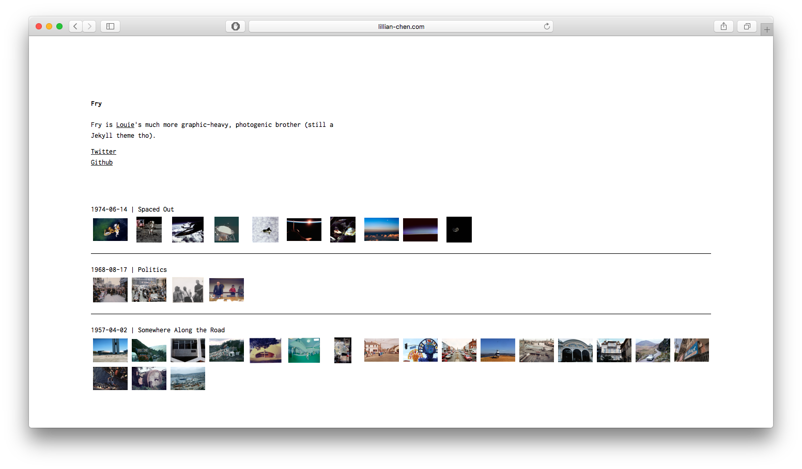
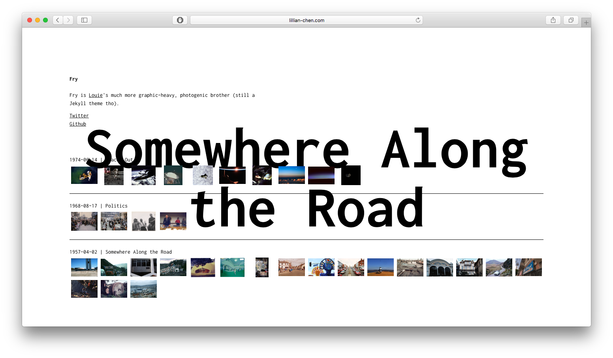
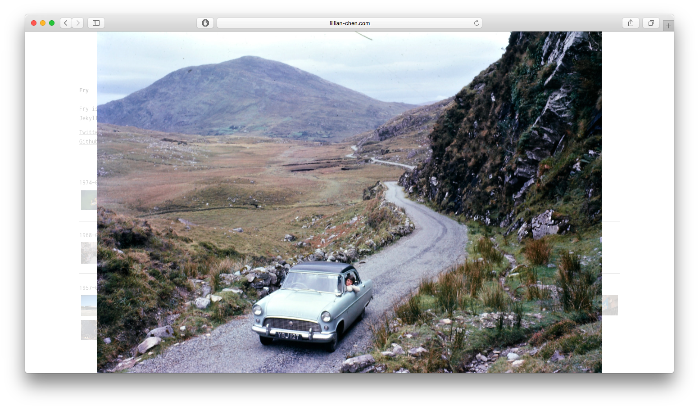

# Fry
=======
Fry is [Louie](https://github.com/lllychen/louie)'s much more graphic-heavy, photogenic brother (still a Jekyll theme tho).





## Installation
Add this line to your Jekyll site's Gemfile:

```ruby
gem "fry"
```

This [article](https://henriwoodcock.medium.com/how-to-create-a-projects-page-on-jekyll-3bcf129f3efd) was helpful for adding the "journal" page to the Fry theme.
